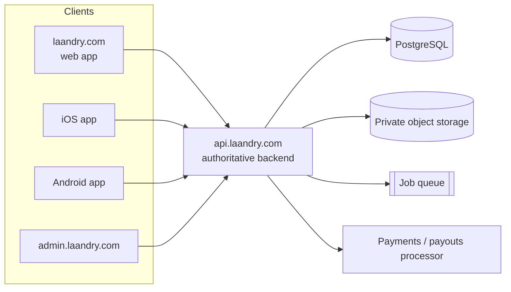
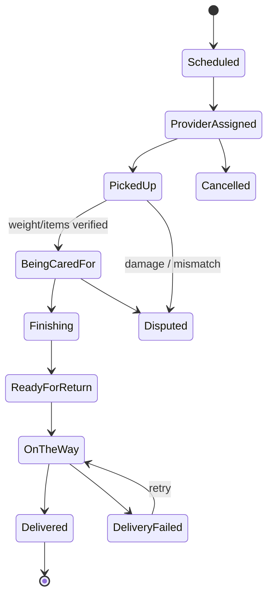
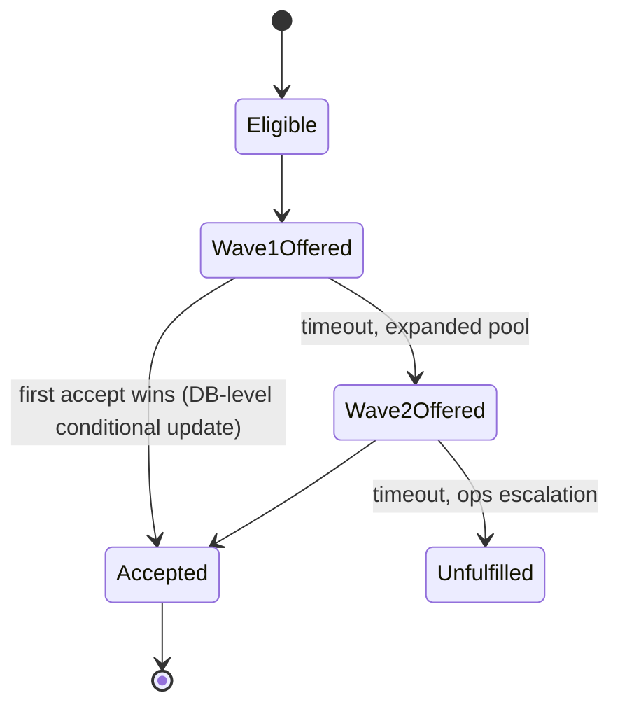
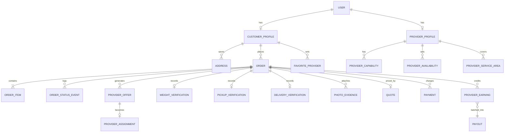

# Laandry — Phase 0 Foundations

Status: Phases 0–7 done (repo scaffold through pickup/weight
verification — see §19–§23 and §26), a Phase-13 security slice pulled
forward (§24), and a live deployment on real infrastructure, now on
laandry.com (§25). Per the development process this repo follows, no
feature work begins until each phase's gate passes.

## 0. Repository audit

`E:\Git-laandry\Laandry` is empty — no package.json, no git history, no prior
app. This is a greenfield start, not a migration. Everything below is a
proposal, not a description of existing code.

## 1. Architecture overview

Four surfaces, one backend:

- **laandry.com** — public marketing site + authenticated customer web app
- **Laandry iOS / Android** — customer + provider native apps
- **admin.laandry.com** — operations command center (desktop web only)
- **api.laandry.com** — the one authoritative backend all four talk to

Frontend: Expo + Expo Router + TypeScript (strict) + React Native Web, shared
across customer mobile/web and (mostly) provider mobile. Public marketing
routes render statically for SEO; the authenticated app is a client that
calls the API — no server-side business logic lives in Expo's (still-alpha)
request-time SSR. Admin is a separate Next.js (or similar) desktop-first web
app — forcing it into the same mobile-shaped component set would hurt the
one audience that needs data density, not touch targets.

Target code sharing is **70–85%**, not 100%:

| Shared | Platform-specific |
|---|---|
| Booking flow, pricing/quote calls, order state, preferences, auth, provider workflow logic | Camera capture (native), background GPS (native), desktop nav & data tables (web), admin (web-only), marketing SEO metadata (web-only) |

Backend: a single API service (Node/TypeScript, e.g. NestJS or Fastify) is
authoritative for pricing, permissions, provider assignment, order state,
payments, credits, promotions, payouts, and verification. Supporting
infrastructure: PostgreSQL, private object storage (S3-compatible), a job
queue (e.g. BullMQ/SQS) for offer waves and notifications, a realtime channel
(WebSocket/Pusher-style) for live order + offer state, a payments/payouts
processor with marketplace support (e.g. Stripe Connect), transactional
email, SMS, and push.



## 2. Route map

**Public (statically rendered, SEO-capable)**

`/` `/how-it-works` `/services` `/services/everyday-laundry`
`/services/garment-care` `/services/travel` `/providers` `/gift-cards`
`/privacy` `/security` `/help`

**Auth (public)**

`/login` `/register`

**Customer app (authenticated, not indexed)**

`/book` (4-screen flow) `/orders` `/orders/[id]` `/preferences` `/account`
`/wallet` `/referrals` `/store`

**Provider app (native-first, web where practical)**

`/provider/home` `/provider/offers` `/provider/orders/[id]`
`/provider/earnings` `/provider/availability` `/provider/onboarding`

**Admin (admin.laandry.com, desktop web)**

`/dashboard` `/orders` `/customers` `/providers` `/applications`
`/service-areas` `/pricing` `/promotions` `/gift-cards` `/referrals`
`/products` `/payments` `/payouts` `/refunds` `/disputes` `/incidents`
`/reviews` `/reports` `/audit` `/settings`

## 3. Journeys

**Customer:** land on laandry.com → pick a service → set care preferences
(saved as "My Laandry Preferences") → pickup/return details → review with
transparent estimate → `Schedule My Laandry` → track through friendly
milestones → delivered → tip/rate → `Do My Laandry Again` next time skips
straight to a time picker.

**Provider:** apply → identity + service-area + equipment onboarding →
approval → set availability → receive eligible offers (wave-based, not
broadcast to everyone) → accept (atomic — only one provider wins) → pickup
verification → process against the customer's preference snapshot → return
verification → paid, with tips.

**Admin/ops:** dashboard of live orders and exceptions → drill into an
order's full event history → manage provider applications and service
areas → configure pricing/promotions → handle refunds/disputes/incidents →
audit log for every privileged action.

## 4. State machines

**Order lifecycle** (customer-visible milestones map onto a larger internal
set — customers never see raw internal states):



Internal-only exception states layered on top: `CUSTOMER_UNAVAILABLE`,
`PROVIDER_UNAVAILABLE`, `ORDER_MISMATCH`, `DAMAGED_ITEM_REPORTED`,
`UNSUPPORTED_ITEM`, `PAYMENT_HOLD`. Every transition is a server-enforced
command (`POST /orders/:id/transitions`), never a client-set field.

**Provider offer / assignment** (solves the "two providers accept at once"
race with an atomic conditional update, not UI state):



## 5. Role / permission matrix

| Role | Own orders | Others' orders | Pricing rules | Provider approval | Payouts | Audit log |
|---|---|---|---|---|---|---|
| Customer | R/W (own) | — | — | — | — | — |
| Provider | R/W (assigned) | — | — | — | own earnings | — |
| Support | R (assigned tickets) | R | — | — | — | — |
| Dispatch | — | R/W (assignment) | — | — | — | — |
| Finance | — | R | R | — | R/W | R |
| Ops Manager | — | R/W | R/W | R/W | R | R |
| Admin | — | R/W | R/W | R/W | R/W | R |
| Super Admin | — | R/W | R/W | R/W | R/W | R/W |

Enforced server-side per resource/action, not by hiding buttons. Automated
tests must prove cross-tenant isolation (see §16).

## 6. Data classification

| Category | Examples | Sensitivity | Handling |
|---|---|---|---|
| Identity | Name, login, DOB (provider KYC) | High | Encrypted at rest, access-logged |
| Contact | Phone, email, address | High | Masked between customer↔provider; exact address revealed to provider only after assignment |
| Location | Pickup GPS, live tracking during active leg | High | Collected only while operationally relevant; provider home/processing location never exposed |
| Payment | Card tokens, payout bank details | Critical | Never touches our DB directly — processor-tokenized only |
| Order content | Preferences, item lists, weight | Medium | Scoped to order participants |
| Photo evidence | Pickup/condition photos | High | Private storage, short-lived signed URLs, order-scoped |
| Financial ledger | Charges, credits, payouts, tips | High | Immutable append-only entries, audit-logged |
| Marketing/public | Service pages, pricing ranges | Low | Public, indexable |

## 7. Threat model (selected, STRIDE-flavored)

| Threat | Vector | Mitigation |
|---|---|---|
| Cross-tenant data read | Guessable/sequential order IDs | UUIDs + server-side ownership check on every read, not just UI routing |
| Race-condition double-assignment | Two providers tap accept simultaneously | Atomic conditional DB update (`UPDATE ... WHERE status='eligible'`), tested under concurrency |
| Address leakage | Provider views order before accepting | Approximate area/distance pre-accept, exact address only post-assignment |
| Price tampering | Client sends total at checkout | Server recomputes from a versioned Quote object; client total is ignored |
| Replay/duplicate charge | Payment webhook retried | Idempotency keys + webhook signature verification |
| Photo exposure | Public bucket / guessable filename | Private bucket, signed URLs, order-scoped ACL |
| Privilege escalation | Support account performs admin action | Resource-level server authorization per role, tested explicitly |
| Promo abuse | Referral/promo code farming | Per-user + global limits, qualifying-event-based referral credit (first completed paid order, not signup) |
| Session hijack | Stolen token from insecure storage | Secure session storage per platform, MFA for staff/admin, device revocation |

## 8. Database schema (core entities, grouped)



Additional entities not diagrammed for space: `OrderBag`, `OrderService`,
`OrderPreferenceSnapshot`, `Incident`, `PricingRule`, `Promotion`,
`PromotionRedemption`, `Referral`, `AccountCreditLedger`, `GiftCard`,
`GiftCardLedger`, `Product`, `StoreOrder`, `Refund`, `Tip`, `Notification`,
`Review`, `AuditEvent`. Orders are deliberately not one wide table — bags,
items, services, and preference snapshots are their own rows so an order
can mix a weight-based load with individually-tracked garments.

## 9. Pricing architecture

The client never supplies an authoritative price. Booking produces a
versioned **Quote**: service + estimated weight range + add-ons +
promotions → server-evaluated `PricingRule` set → line-itemized estimate
shown at Review. At verification, if actual weight/items materially exceed
the customer's authorized tolerance, the order pauses for customer approval
before the higher charge is finalized — no surprise charges.

## 10. Payments & payout architecture

Marketplace-capable processor (customer charges and provider payouts are
separate accounting flows, e.g. Stripe Connect). No raw card data touches
our servers. Every financial event — charge, adjustment, promo, credit,
refund, tip, provider earning, platform fee, payout — is an immutable
ledger entry, not an overwritten balance. Webhooks are signature-verified
and idempotent, so a duplicated webhook cannot double-credit an earning or
double-fire a payout.

## 11. Privacy architecture

Exact pickup address is withheld from a provider until they accept the
offer; only approximate area/distance is shown pre-accept. Provider
processing/home address is never shown to a customer. In-app or masked
messaging replaces raw phone-number exchange. Photo evidence is optional
where not operationally required, private-storage-only, and access-scoped
to the order.

## 12. Location architecture

Live tracking runs only while a provider is actively traveling for an
active leg of a specific order — not continuously, not while off duty.
Background location follows each platform's permission model; the web
client has a reduced/best-effort fallback since browsers can't guarantee
background GPS. Location history is not logged indefinitely.

## 13. Photo / file architecture

Private object storage, no public bucket. Access is via short-lived signed
URLs scoped to the order and the requesting party's authorization. Uploads
are validated by file signature and size, not filename or client-supplied
MIME type. Retention follows policy, not indefinite default storage.

## 14. Notification architecture

| Event | Push | SMS | Email | In-app |
|---|---|---|---|---|
| Order scheduled | ✓ | — | ✓ (receipt) | ✓ |
| Provider assigned / en route | ✓ | ✓ (opt-in) | — | ✓ |
| Pickup / delivery complete | ✓ | ✓ (opt-in) | ✓ (receipt) | ✓ |
| Weight exceeds estimate — approval needed | ✓ | ✓ | — | ✓ |
| Provider: new offer | ✓ | — | — | ✓ |
| Payout processed | — | — | ✓ | ✓ |

## 15. Repository structure (proposed monorepo)

```
laandry/
  apps/
    app/            # Expo Router — customer + provider, native + web
    admin/           # Next.js — desktop-only ops console
    api/              # Node/TS backend
  packages/
    ui/               # shared design-system components (RN + web)
    domain/          # shared types, state machines, pricing/quote logic
    api-client/      # typed client used by app + admin
  infra/              # migrations, IaC
  docs/
```

## 16. Test strategy

Standard pyramid (unit → API/integration → E2E), plus a **mandatory**
authorization suite proving: Customer A cannot read Customer B's order or
photos; Provider A cannot read Provider B's order; an unassigned provider
cannot obtain an exact address; a customer cannot obtain a provider's
residential address; a customer cannot see a provider's payout info; a
support account cannot perform a super-admin action; editing an order ID
in a request does not bypass authorization.

Required E2E paths: booking → offer/acceptance → pickup → verification →
processing → return → delivery → payment → provider earnings → rebook —
and their failure modes: no provider accepts, simultaneous acceptance,
payment failure, weight exceeds estimate, cancellation (either side),
unsupported garment, missing/damaged item, failed delivery, dropped
network, duplicate tap, expired verification, unauthorized access attempt.

## 17. MVP boundary

**In:** Everyday Laundry (weight-based) + one item-based category (formal
garments), booking, pricing engine, provider matching with atomic
acceptance, pickup/processing/delivery verification, payments, provider
earnings + payout, tips, ratings, rebook, preferences, admin order/provider
management, core notifications.

**Deferred:** subscriptions, store/product commerce beyond a minimal
add-on set, gift cards, referrals, favorite-provider guarantees beyond
best-effort, multi-language, advanced promotion rule types. The schema
accommodates all of these later without an order-model rewrite.

## 18. Phased implementation sequence

| Phase | Scope | Gate to proceed | Status |
|---|---|---|---|
| 0 | This document | Reviewed & agreed | ✅ Done |
| 1 | Repo scaffold, routing, design system, DB migrations | Builds, typechecks | ✅ Done |
| 2 | Auth, roles, authorization test harness | Auth tests passing | ✅ Done — 36/36 tests passing (see §19) |
| 3 | Customer onboarding, addresses, preferences | — | ✅ Done — 50/50 tests passing (see §20) |
| 4 | Booking, pricing/quote, payment authorization | Quote never trusts client total (tested) | ✅ Done — 68/68 tests passing (see §21) |
| 5 | Provider onboarding, capabilities, availability | — | ✅ Done — 84/84 tests passing (see §22) |
| 6 | Matching, offers, atomic acceptance | Concurrency test passing | ✅ Done — 93/93 tests passing (see §23) |
| 7 | Pickup, verification, bag/item/weight tracking | — | ✅ Done — 109/109 tests passing (see §26) |
| 8 | Processing workflow, preference snapshot, incidents | — | ✅ Done — 122/122 tests passing (see §27) |
| 9 | Return/delivery, POD, tips, reviews | — | ✅ Done — 132/132 tests passing (see §28) |
| 10 | Admin console | — | ✅ Done — 136/136 apps/api+domain tests passing (see §29) |
| — | *Out of sequence: real transactional email (Resend)* | — | ✅ Done — 142/142 tests passing (see §30) — triggered by real credentials becoming available, not by phase order |
| 11 | Promotions, referrals, gift cards | — | Next |
| 12 | Store | — | — |
| 13 | Security hardening, accessibility, responsive QA, full E2E, staging | All critical-path E2E + auth tests green | — |

No phase begins while the current phase has failing security-critical
tests.

## 19. Phase 2 — what shipped

Auth lives in `apps/api/src/auth/`. Password hashing via Node's built-in
scrypt (no native dependency); sessions are a short-lived JWT access token
(role embedded, not re-checked against the DB until refresh) plus an opaque
refresh token whose SHA-256 hash is the only thing stored, rotated on every
use so a replayed old refresh token is rejected. MFA (TOTP, via `otpauth`)
is required at login for every role in `requiresMfa()` — every role except
`customer` — once enrolled; a privileged user without MFA enrolled yet can
still log in, flagged `mfaSetupRequired`, so enrollment itself isn't a
chicken-and-egg lockout.

Authorization is `requireAuth` → `requireRole` / `requirePermission`, the
latter calling `hasPermission` from `packages/domain` against the §5
matrix. Public `/auth/register` only ever creates `customer` accounts —
every other role is provisioned out-of-band (provider application review in
Phase 5, staff accounts created by an existing admin).

The authorization test harness (`apps/api/src/auth/test-helpers.ts`) runs
against an `InMemoryAuthRepository` behind the same `AuthRepository`
interface `PrismaAuthRepository` implements, so the suite needs no live
Postgres — `getPrisma()` in `db.ts` is never even called in tests. 36
tests pass (`npm test` from the repo root): registration, login (including
the MFA-required and MFA-setup-required paths), refresh rotation/replay
rejection, logout/session revocation, and the authorization edge cases from
§16 that don't require an Order to exist yet — unauthenticated, wrong role,
forged/expired/wrong-secret tokens. The order/photo-specific cases in §16
(cross-tenant order and address access) get written against this same
harness once Order endpoints exist, in Phase 4/6/7.

Not done in Phase 2: session/device management UI, "sign out everywhere,"
and password reset — `revokeAllSessionsForUser` exists on the repository
interface for when those land.

## 20. Phase 3 — what shipped

Registering a customer now provisions a `CustomerProfile` in the same flow
(`onCustomerRegistered` callback wired in `app.ts`, so `auth/routes.ts`
still doesn't need to know the customer module exists). "My Laandry
Preferences" is a shared Zod schema (`packages/domain/src/preferences.ts`)
with defaults for every field, so a brand-new profile is immediately
complete — `PUT /me/preferences` replaces it wholesale, validated
server-side. Addresses are full CRUD under `/me/addresses`, and every
single-address route (`PATCH`/`DELETE /me/addresses/:id`) re-fetches the
address and checks `customerId` against the caller's own profile before
touching it — the exact "changing the ID in the URL" IDOR case from §16,
now with a passing test for it (`customer.test.ts`).

Same repository-interface pattern as auth: `CustomerRepository` has an
`InMemoryCustomerRepository` for tests and a `PrismaCustomerRepository` for
real, so this phase's tests need no live Postgres either.

On the client: `apps/app` has real `/login` and `/register` screens, a
non-React `auth-store.ts` (subscribed to via `useSyncExternalStore`, so
auth state doesn't need a context provider wrapping the tree) that persists
tokens via `expo-secure-store` on native and `localStorage` on web, and
restores the session once at app start. `/preferences` and `/account` are
no longer placeholders — they're real forms against the API, with `/account`
also handling add/remove address and sign-out. `packages/api-client` grew
typed methods for every new endpoint.

**Known gap, called out rather than hidden:** the web token-storage
fallback (`localStorage`) is not equivalent to native's OS keychain — a
browser-side XSS bug could read it. Closing that means moving the web
client to httpOnly session cookies set by the API, which changes the
client/API contract enough that it's deliberately deferred rather than
rushed into this phase.

**Verified — 50/50 tests passing** (`npm run test`; 24 in `apps/api`, 26 in
`packages/domain`), full-repo `typecheck` clean, and all three
apps/{app,admin,api} build. `apps/app`'s static web export was re-run and
still renders all 27 routes (25 from Phase 1 + `/login` + `/register`).
**NOT VERIFIED:** the client screens against a live API — this sandbox has
no Postgres/Docker, so `/auth/register` et al. were confirmed to fail
correctly (clean 500, not a crash) rather than confirmed to succeed
end-to-end. Run `docker compose -f infra/docker-compose.yml up -d` and
`npx prisma migrate dev` to close that gap locally.

## 21. Phase 4 — what shipped

**Pricing** (`packages/domain/src/pricing.ts`) is a pure, deterministic
function: service + weight tier (everyday/travel) or itemized list
(garment-care/household) + the customer's preference snapshot in, a
line-itemized `ComputedQuote` out. Rates are illustrative MVP placeholders,
not real business pricing — Phase 10 makes them data-driven (a
`PricingRule` admin UI) behind this same function signature. A `POST
/quote-preview` endpoint runs it with no persistence and no payment, so
Review can show a real number before the customer commits to anything —
and a test proves that number is exactly what booking then charges.

**Booking** (`apps/api/src/order/`) is one endpoint,
`POST /orders`: validate the address belongs to the caller → merge saved
preferences with any per-order overrides → `computeQuote()` → authorize
payment for that total → persist Order + OrderItems + Quote v1 + Payment
together (Prisma nested write, one atomic query). The request schema
(`bookingServiceInputSchema.and(...)`, zod) has no field for a price, so
there's structurally nothing for a client to tamper with — and
`order.test.ts` sends a forged `totalCents`/`lineItems` alongside a real
request anyway and asserts the server's number wins.

**Payment authorization** (`apps/api/src/payments/`) is an interface —
`PaymentProvider.authorize()` — with exactly one implementation,
`FakePaymentProvider`, which is deliberately honest about not being Stripe:
it declines only on the literal token `"tok_declined"` and authorizes
everything else. No `StripePaymentProvider` exists yet because this
environment has no processor credentials to build one against; writing a
provider that *looks* wired up without ever calling a real API would be
worse than the honest gap. `apps/app`'s Review screen surfaces this
directly — the payment field is labeled "test token," not disguised as a
card form.

**Authorization**, finally exercised on a real owned resource: `GET
/orders/:id` calls `hasPermission(role, "order", "read", { isOwner })`
from `packages/domain` — the exact mechanism Phase 2 built and could only
test generically until there was an `order` to test it against. Customer
A reading Customer B's order now returns 404 (§16's flagship case), with
a passing test.

**Client**: `/book` is a real 4-step wizard (Service → Care → Pickup →
Review) against `apps/app/src/app/book.tsx` — weight tiers and item
catalogs render their real prices from `packages/domain` (not a second
hardcoded copy), pickup windows are computed as real ISO timestamps against
a small preset list (no date-picker dependency added for this), and Review
calls `/quote-preview` before the customer ever taps "Schedule My
Laandry." `/orders` and `/orders/[id]` are wired to the live API, with the
order-status → friendly-milestone mapping (`toCustomerMilestone`) driving
both the list and the detail tracker, exactly as specified in the original
milestone list (Scheduled → … → Delivered).

**Verified — 68/68 tests passing** (35 in `apps/api`, 33 in
`packages/domain`), full-repo `typecheck` clean, all three apps build, and
`apps/app`'s static web export still renders all 27 routes. Live-boot
smoke test confirmed the new routes are registered and correctly
401/reject rather than crash. **NOT VERIFIED:** the booking flow against a
live Postgres (same Docker gap as every prior phase) and, separately,
against a real payment processor (no credentials in this environment —
tracked as the `StripePaymentProvider` follow-up, not silently assumed
away).

**Deliberately out of scope for Phase 4:** weight-verification-triggered
re-approval (the `exceedsWeightTolerance` helper from Phase 1 is ready, but
there's no provider workflow yet to call it from — that's Phase 7), and
provider matching/assignment (Phase 6), so a booked order simply sits at
`SCHEDULED` for now.

## 22. Phase 5 — what shipped

Providers apply through a dedicated `POST /provider/apply`
(`apps/api/src/provider/`) — never through `/auth/register`, which stays
customer-only, exactly as flagged as a forward reference back in Phase 2.
Applying creates a `User(role=provider)` + `ProviderProfile` at
`APPLICATION_STARTED` and issues a session the same way registration does;
the shared piece (`issueSession`) was pulled out of `auth/routes.ts` into
`auth/session.ts` so both call sites use exactly one implementation.

**State machine**: `packages/domain/src/provider-status.ts` mirrors the
Order/Offer state machines from Phase 1 — same shape, same
assert-or-throw pattern, same "never settable directly by a client"
discipline. `isProviderEligibleForWork()` returns true only for `ACTIVE`,
which is the exact check Phase 6's matching will call before offering a
provider any work — nothing before that phase touches it yet, but the
line one phase from now will be one line.

**The gap named, not hidden:** identity-document verification and
training modules don't exist — there's no file/photo-upload architecture
yet (that's a later phase) — so `APPLICATION_STARTED → REVIEW_PENDING` is
reachable directly once a provider has at least one capability and one
service area, skipping `IDENTITY_PENDING`/`TRAINING_PENDING` for now. The
state machine still has both states and still refuses to skip a step it
hasn't been told to allow; there's just currently no caller that asks it
to require them.

**Minimal admin action, not the Phase 10 console:** `POST
/admin/providers/:id/approve` is the one write `ops_manager`/`admin`/
`super_admin` can currently make against a provider application — it
exercises the `provider_approval` grant from the §5 matrix for the first
time (a customer or a provider gets 403; approving a provider that isn't
in `REVIEW_PENDING` gets 409, not a silent no-op). There is no review
queue, no list of pending applications, no UI for this beyond calling the
endpoint directly — that's genuinely Phase 10's job, and this is the
single authorized action it will call once it exists.

**Client**: `/providers` (previously a static marketing placeholder) now
has a real apply form; `/provider/onboarding` manages capabilities and
service areas and submits for review; `/provider/availability` manages
shift windows and activates the account once approved.
`RequireAuth` grew an optional `role` prop so these screens can refuse a
signed-in *customer* account outright instead of just requiring "signed in
as someone."

**Verified — 84/84 tests passing** (45 in `apps/api`, 39 in
`packages/domain`), full-repo `typecheck` clean, all three apps build, and
the static web export still renders all 27 routes. Live-boot smoke test
confirmed the new routes are registered and reject correctly (401/400)
without a live database. **NOT VERIFIED:** the full apply → capabilities →
service area → submit → admin-approve → availability → activate lifecycle
against a real Postgres (same Docker gap as every prior phase) — it is,
however, the single most end-to-end-tested flow in the codebase so far at
the in-memory-repository level (one test walks the entire lifecycle in
order).

## 23. Phase 6 — what shipped, including the bug this phase's own gate caught

`apps/api/src/matching/` owns `ProviderOffer` and `ProviderAssignment`.
Dispatch is synchronous, not queued: `POST /orders` calls an
`onOrderBooked` callback (same pattern as `onCustomerRegistered` from
Phase 3) right after the booking commits, which finds every `ACTIVE`
provider with the right capability, a service area whose postal prefix
covers the pickup address, and an availability window overlapping the
pickup window (`ProviderRepository.findEligibleProviders`, new this
phase), and creates a wave-1 `ProviderOffer` for each. **Wave 2 /
escalation is not implemented** — there's no job scheduler yet to run a
timeout against, so every dispatch stays wave 1 until a later phase adds
one; the domain state machine still has `WAVE_2_OFFERED` and refuses to
skip to it, there's just no caller yet.

**The gate did its job.** The first version of `tryAcceptOffer` used a
conditional `UPDATE ... WHERE status IN (...)` on the individual offer row
— textbook-correct for "the same offer can't be accepted twice," and
exactly what docs/ARCHITECTURE.md §7 describes. It shipped, typechecked,
and every other test passed. The concurrency test then failed: **both**
providers got `200`. The bug was real — each eligible provider gets their
*own* offer row for the same order, so a conditional update scoped to one
offer row does nothing to stop a *different* row, for the same order,
from also winning. The fix moves the actual race-arbiter to
`ProviderAssignment.orderId`, which is unique: `tryAcceptOffer` now
attempts to *insert* the assignment first, and only proceeds to mark the
offer `ACCEPTED` and the order `PROVIDER_ASSIGNED` if that insert
succeeds. In Postgres this is a unique-constraint conflict (caught as
Prisma error `P2002`) if another transaction's insert for the same
`orderId` already committed; in the in-memory repository it's a
synchronous `Map.has()` check before any `await`, which gives the same
"exactly one caller can pass this point" guarantee for the reasons
explained in `matching/memory-repository.ts`'s comments. Sibling offers
for the same order (wave 1 or wave 2, whichever didn't win) transition to
`UNFULFILLED` — a legal move `packages/domain/src/offer.ts` didn't allow
until this phase (it only allowed that from `WAVE_2_OFFERED`), fixed there
too, with a test.

**Privacy** (§11): `GET /provider/offers` returns an `approximateArea`
string (city + 3-digit postal prefix) built server-side — never the
street address. `GET /provider/orders/:id`, which returns the exact
address plus the full preference snapshot, checks
`ProviderAssignment.providerId` and 404s (not 403) for anyone else,
including a provider who merely has a *pending, unaccepted* offer on that
order — tested explicitly.

**Verified — 93/93 tests passing** (53 in `apps/api`, 40 in
`packages/domain`), including the concurrency test itself re-run 5 times
back to back with no flake (the synchronous-critical-section reasoning
above is what makes that deterministic rather than lucky). Full-repo
typecheck clean, all three apps build, static web export renders all 27
routes, live-boot smoke test confirms the new routes reject correctly
without a database. **NOT VERIFIED:** the same concurrency guarantee
against a *real* concurrent Postgres — no Docker in this sandbox, so the
Prisma path's correctness rests on the unique-constraint mechanism being
sound (a well-established pattern) plus the in-memory equivalent actually
passing, not on having watched two real overlapping transactions collide
against a live database. Running this phase's test suite against
`DATABASE_URL` pointed at a real Postgres, ideally with an artificially
delayed/interleaved variant of the concurrency test, is the concrete way
to close that gap.

## 24. Security hardening, pulled forward from Phase 13

The user asked directly for a security pass ahead of a live deployment, so
this pulls a slice of Phase 13 forward rather than waiting. `apps/api`
(`app.ts`) now has:

- **`@fastify/helmet`** with an API-appropriate CSP (`default-src 'none'`,
  `frame-ancestors 'none'`) — this service serves no HTML of its own, so
  helmet's browser-page-oriented defaults were tightened rather than kept.
- **`@fastify/cors`** against an explicit `CORS_ORIGINS` allowlist (new
  env var) — no wildcard. `credentials: false`, since auth is Bearer-token
  in a header, never a cookie.
- **`@fastify/rate-limit`**: a global 300/min-per-IP floor, plus a much
  tighter 10/min override on every unauthenticated account-touching
  endpoint (`/auth/register`, `/auth/login`, `/auth/refresh`,
  `/provider/apply`) and 5/min on `/auth/mfa/verify` specifically — a
  6-digit TOTP code is only 1,000,000 possibilities, so that one route
  needed its own number.
- **Log redaction**: Fastify's default request logging serializes
  `req.headers`, which includes the `Authorization` bearer token and any
  cookies — now explicitly redacted before anything reaches a log sink.
- **A global error handler** that logs the real error (with stack) server
  side and returns a generic `INTERNAL_SERVER_ERROR` for any 5xx — no
  internal message or stack trace reaches the client. Verified with a test
  that forces a real thrown error and asserts the response body never
  contains it.

Four new tests in `apps/api/src/security.test.ts` check headers, CORS
allow/deny, the rate-limit cutoff, and the error-leak boundary — 97/97
tests pass repo-wide after this change (57 API, 40 domain).

**What this is not:** a full Phase 13 pass. Still outstanding for that
phase specifically: dependency/vulnerability scanning as a CI gate,
accessibility audit, load/performance testing, and the full E2E suite
against staging. This section covers request-layer hardening on the API
only — see the rest of this document (and the live-deployment
conversation) for what's still open on the client and infra side.

## 25. Live deployment

All three pieces are deployed to Vercel, backed by a real Supabase
Postgres — the first genuinely live environment for this project.

| Piece | URL | What it is |
|---|---|---|
| API | `api-dusky-nine-29.vercel.app` | Fastify wrapped as a Vercel Node function |
| Customer/provider app | `app-alpha-three-80.vercel.app` | Expo static web export |
| Admin console | `admin-five-tau-14.vercel.app` | Next.js, as built in Phase 1 |

The first real migration (`20260910011212_init`) is applied against the
live database, and the entire register → address → book → dispatch →
accept → exact-address-reveal chain was smoke-tested end to end against
it via curl — closing the "NOT VERIFIED against a live database" caveat
carried since Phase 2. A cross-origin browser-style request (preflight
`OPTIONS` + the real `POST`, `Origin` header set to the deployed app) was
also verified against the deployed API to confirm CORS actually works
between the two live deployments, not just in theory.

**Three real bugs surfaced by deploying that local dev had been silently
masking**, each fixed properly rather than patched around:

1. **Missing `prisma generate` on install.** The build has always
   depended on a manual `npx prisma generate` step that local dev
   happened to always have run. A fresh `npm install` never triggered it,
   so `@prisma/client` shipped with no generated model types and the
   build failed. Fixed with `"postinstall": "prisma generate"` in
   `apps/api/package.json` — verified by wiping the generated client
   locally and re-running `npm install` clean.
2. **`packages/api-client` never declared `@types/node`.** It uses
   `fetch`/`RequestInit` but only ever typechecked because npm workspaces
   hoists `apps/api`'s `@types/node` to the shared root `node_modules`,
   and TypeScript auto-includes any `@types/*` package it finds up the
   tree. Deploying the admin console in isolation (without `apps/api` in
   the dependency graph) surfaced it. Fixed by declaring the dependency
   explicitly where it's actually used.
3. **Static export routing.** `expo export --platform web` writes flat
   files (`book.html`) and, for dynamic routes, literal bracket filenames
   (`orders/[id].html`). Vercel's static file server needs `cleanUrls` for
   the former and explicit rewrites (with the brackets percent-encoded in
   the destination — a literal `[id]` in a rewrite destination doesn't
   resolve to the file of that name) for the latter. Fixed in
   `apps/app/vercel.json`.

**Deliberately not done, and why:**

- **No real payment processor.** `FakePaymentProvider` is what's live —
  same as every environment so far. A `StripePaymentProvider` needs real
  credentials this project doesn't have yet.
- **Admin console has no login screen** (Phase 10 isn't built) and is
  reachable by anyone with the URL. It shows no real data yet — Phase 10
  wiring doesn't exist — so today's actual exposure is low, but this is
  not a "solved" state. Vercel's CLI-driven password protection
  (`vercel project protection enable --password`) reported success but
  did **not** actually gate the production URL when verified — that's
  reported here as a known gap, not silently assumed to have worked.
  Enabling it from the Vercel dashboard directly (Project → Settings →
  Deployment Protection), or simply building real admin auth in Phase 10,
  both close this properly.
- **Native iOS/Android are not live anywhere.** "Live" here means the web
  export. Shipping to the App Store/Play Store needs developer accounts,
  signing, and an EAS build pipeline — a materially different, much
  larger effort than a web deploy, not attempted.
- **Vercel's GitHub integration auto-imported a broken project** (named
  `laandry`, root directory guessed as the nonexistent `apps/web`) the
  moment the repo went public — removed and replaced with three
  correctly-configured projects (`laandry-api`, `laandry-app`,
  `laandry-admin`), each with root directory pinned explicitly. Worth
  knowing if a future push triggers another auto-import: check
  `vercel project ls` for a project misconfigured the same way.

**Update:** `laandry.com` itself was already registered and pointed at
Vercel (by the user, separately) but never assigned to a project — fixed
by assigning it to `laandry-app` and adding `api.laandry.com` /
`admin.laandry.com` to the other two, with `CORS_ORIGINS` updated to match
and verified with a real cross-origin request from that origin. The two
subdomains needed A records at the registrar that only the user could
add; both were confirmed live once added.

## 26. Phase 7 — what shipped

`apps/api/src/fulfillment/` owns `PickupVerification` and
`WeightVerification` (both were already in the schema since Phase 1 —
no migration needed this phase). Two different paths out of
`PROVIDER_ASSIGNED`:

- **Item-based orders** (garment-care, household) — `POST
  /provider/orders/:id/pickup` records the pickup and walks the order
  straight through `PICKED_UP → BEING_CARED_FOR` in one call, since the
  items were already itemized at booking; there's nothing left to verify.
- **Weight-based orders** (everyday laundry, travel) — pickup stops at
  `PICKED_UP`. A separate `POST /provider/orders/:id/verify-weight` either
  clears immediately (within the tolerance from `exceedsWeightTolerance`,
  built in Phase 1 and unused until now) or leaves the order at
  `PICKED_UP` with `requiredApproval: true` — deliberately *not* a new
  `OrderStatus`; "pending approval" is just `PICKED_UP` plus a
  `WeightVerification` row without a resolution yet, which needed no
  change to the state machine at all.

**Re-pricing an overage** is tier-resolution, not a continuous rate:
`resolveWeightTierForPounds` (new in `packages/domain/src/pricing.ts`)
maps the verified weight to whichever tier actually covers it, and
`POST /orders/:id/approve-weight` recomputes a full `ComputedQuote` at
that tier, authorizes the *difference* as a new payment (never edits the
original), and only then advances the order — a declined additional
payment leaves the order at `PICKED_UP`, tested explicitly. Declining
the overage outright is a deliberate MVP simplification: the order still
proceeds at the original price rather than attempting partial
fulfillment (refusing laundry already in a provider's hands) — documented
in the route's own comments, not hidden.

Every ownership check follows the established pattern: a provider not
assigned to the order gets 404 on pickup/weight endpoints (not 403,
never confirming the order exists to someone without access), and a
customer other than the order's owner gets 404 approving/declining someone
else's overage.

**Verified — 109/109 tests passing** (68 in `apps/api`, 41 in
`packages/domain`), full-repo typecheck clean, all three apps build,
static web export renders every route. **NOT VERIFIED:** against the live
database specifically for this phase's new tables — they were part of the
original Phase 1 schema already migrated live, so no new migration was
needed, but the pickup/weight-verification *flow itself* hasn't been
re-run against Supabase the way Phase 6's was; the in-memory-repository
test suite is what's actually been exercised.

## 27. Phase 8 — what shipped

`apps/api/src/processing/` owns the second half of the order's time in a
provider's hands: `BEING_CARED_FOR → FINISHING → READY_FOR_RETURN`, plus
an incident-reporting pathway that runs alongside both without gating
either. Two new tables — `Incident` and `ProcessingConfirmation` — needed
a real migration this time (`20260910024419_phase8_processing_incidents`),
applied against the live Supabase database, not just against the
in-memory test repositories.

**"Provider confirms required stages" is a server-side check, not a UI
checklist.** `packages/domain/src/processing.ts` adds
`requiredProcessingStages(preferences)`, a pure function deriving exactly
which stages a given order's `preferenceSnapshot` requires: every order
needs `wash` and `dry`; exactly one of `fold`/`hang` depending on the
customer's saved finish preference; `iron` only if they requested it.
`POST /provider/orders/:id/confirm-processing` takes the provider's
`confirmedStages` and checks it against that required set with
`stagesSatisfyRequirement` (order-independent, exact-match, no
duplicates-standing-in-for-missing-stages) — a provider can't advance the
order by checking three boxes when the customer's preferences call for
four. A `ProcessingConfirmation` row records which stages were actually
confirmed and by whom, same "evidence for a later dispute" rationale as
Phase 7's `PickupVerification`/`WeightVerification`. The customer's care
preferences were already rendered prominently on the provider's order
screen since Phase 7 (`apps/app/src/app/provider/orders/[id].tsx`); this
phase adds the checklist immediately below it, driven by the same
preference snapshot.

**Incidents are deliberately not part of the order state machine.**
`packages/domain/src/incident.ts` models `Incident` as a two-state flag
(`OPEN`/`RESOLVED`) with no transition table of its own, and no route in
`processing/routes.ts` ever checks incident status before allowing
`confirm-processing` or `ready-for-return` to proceed — reporting a
damaged/missing/unsupported item is explicitly *not allowed to force a
false all-clear*, per the original spec, but it's also never allowed to
silently block the order either. `POST /provider/orders/:id/ready-for-return`
surfaces the open-incident count in its response instead of hiding it, so
nothing downstream has to rediscover an open incident by re-querying.
Resolving an incident (`POST /orders/:id/incidents/:incidentId/resolve`)
is deliberately staff-only — it reuses the existing "any"-scoped
`order`/`write` permission grant (dispatch, ops_manager, admin,
super_admin) rather than adding a new permission resource for one action;
the assigned provider can report but not resolve, and the customer can
read but not resolve.

Every ownership check follows the established pattern: a provider not
assigned to the order gets 404 reporting or reading incidents (never
403), and `GET /orders/:id/incidents` reuses the same three-way
customer-own/assigned-provider/staff-any check `GET
/orders/:id/weight-verification` introduced in Phase 7.

**Deliberately out of scope for Phase 8:** the customer can read
incidents but not report their own (a "something arrived wrong" flow
after delivery is Phase 9 territory, alongside POD); no photo evidence
attaches to an incident report (same no-file-upload-architecture gap
flagged since Phase 1); no `AuditEvent` row is written for a resolution,
consistent with `AuditEvent`/`OrderStatusEvent` being modeled in the
schema since Phase 1 but still not wired into *any* route in this
codebase — a systemic gap, not something specific to this phase, so
fixing it here would have been inconsistent with everywhere else that
writes a status change today.

**Verified — 122/122 tests passing** (74 in `apps/api`, 48 in
`packages/domain`), full-repo typecheck clean, all three apps build,
static web export renders every route. Redeployed live (`laandry-api`
and `laandry-app`, both re-aliased to their custom domains) and walked
end to end against the real Supabase database with real HTTP requests,
not just the in-memory test suite: register → address → set ironing
preference → provider apply/onboard/admin-approve/activate → book →
accept → pickup → **confirm-processing with an incomplete stage set
correctly rejected 400 `INCOMPLETE_STAGE_CONFIRMATION`** → report an
incident (`OPEN`) → confirm-processing with the complete,
preference-matched stage set → `FINISHING` → ready-for-return →
**`openIncidentCount: 1`, not hidden** → customer reads the incident
back. `api.laandry.com` itself still doesn't resolve from outside
Vercel's own alias system (same unresolved DNS issue as §25 — verified
via the stable `api-dusky-nine-29.vercel.app` alias instead, same
workaround as every prior phase's live check).

## 28. Phase 9 — what shipped

`apps/api/src/delivery/` owns the last leg of the order lifecycle —
`READY_FOR_RETURN → ON_THE_WAY → DELIVERED`, with a `DELIVERY_FAILED`
detour and retry — plus tips and the post-delivery review, closing out
the customer journey's "... delivered → tip/rate." No migration was
needed this phase: `DeliveryVerification`, `Tip`, and `Review` were all
in the schema since Phase 1 and simply unused until now, same story as
`PickupVerification`/`WeightVerification` before Phase 7.

**The delivery-failed/retry loop is a real second path through the state
machine, not a dead end.** `order.ts`'s `ON_THE_WAY ↔ DELIVERY_FAILED`
transitions were defined since Phase 1 but had no caller until this
phase's `POST /provider/orders/:id/delivery-failed` and
`.../retry-delivery`. A failed attempt is a deliberate MVP
simplification: the optional `reason` a provider gives is returned in
the response but not persisted anywhere — there's still no
events/audit table wired into any route in this codebase (the same
`AuditEvent`/`OrderStatusEvent` gap flagged in §27), so persisting it
here alone would have been inconsistent with every other status change.

**Tips are immutable ledger entries, not a balance.** The `Tip` model
was already schema'd without a unique constraint on `orderId` — Order
Model already anticipated more than one tip per order — so
`POST /orders/:id/tip` never checks for a prior tip before creating a
new one; each call is its own row, matching §10's "immutable ledger
entry, not an overwritten balance." A tip charge goes through the same
`paymentProvider.authorize()` + `orderRepository.addPayment()` path
Phase 7 used for a weight-overage difference — a declined charge (402)
leaves no `Tip` row at all. Tipping (and reviewing) is gated on
`order.status === "DELIVERED"`, matching the journey text exactly rather
than allowing either mid-delivery.

**A review is genuinely one-shot.** `Review.orderId` *is* `@unique` in
the schema (unlike `Tip`), and the route checks for an existing review
before inserting rather than relying on the DB constraint to reject a
duplicate — a second `POST /orders/:id/review` on the same order returns
409 `REVIEW_ALREADY_SUBMITTED`, not a second row or a silently-ignored
overwrite. There's no edit endpoint yet, which is a real limitation, not
an oversight — added if a later phase needs it.

Every ownership check follows the by-now-established pattern: a provider
not assigned to the order gets 404 advancing or reading its delivery
(never 403); a customer other than the order's owner gets 404 tipping or
reviewing someone else's order; `GET /orders/:id/delivery-verification`,
`.../tips`, and `.../review` all reuse the customer-own /
assigned-provider / staff-any three-way read check Phase 7 introduced.

**Deliberately out of scope for Phase 9:** provider earnings and payouts
— `ProviderEarning`/`Payout` are in the schema per §17's MVP boundary but
still have no route touching them anywhere in this codebase, a
pre-existing gap this phase didn't close; building a real earnings
ledger without a real payout mechanism (Stripe Connect or equivalent)
behind it would have been a half-built feature, so it stays explicitly
deferred rather than rushed. No review-editing endpoint. No photo
evidence on a failed-delivery report (same no-file-upload-architecture
gap flagged since Phase 1).

**Verified — 132/132 tests passing** (84 in `apps/api`, 48 in
`packages/domain`), full-repo typecheck clean, all three apps build,
static web export renders every route. Redeployed live (`laandry-api`
and `laandry-app`) and walked end to end against the real Supabase
database with real HTTP requests: booked and processed an order through
to `READY_FOR_RETURN` → start-delivery → **delivery-failed → a
complete-delivery attempt correctly rejected 409 while
`DELIVERY_FAILED`** → retry-delivery → complete-delivery with a real
`DeliveryVerification` row → customer reads the POD back → two separate
tips, each its own ledger row → a declined tip correctly rejected 402
with no row created → a review submitted, then **a duplicate submission
correctly rejected 409 `REVIEW_ALREADY_SUBMITTED`** → the assigned
provider reads the review back. `api.laandry.com`'s own DNS is still
unresolved (same pre-existing issue as §25/§27, verified via the stable
`api-dusky-nine-29.vercel.app` alias as before).

## 29. Phase 10 — what shipped

The admin console (`apps/admin`) went from 20 unauthenticated Phase-1
placeholder pages to a real, staff-authenticated ops tool for the
operational core the API already has real data for. It closes the
"admin console has no login screen" gap flagged as a known live issue
since §25.

**Real staff authentication, not a stub.** `apps/admin/src/lib/auth-store.ts`
mirrors `apps/app`'s auth store (`/auth/login`, session persistence,
`/me` restore-on-load) adapted for a web-only Next.js app — same
documented localStorage tradeoff `apps/app`'s web fallback already
carries (a browser XSS bug could read the token; real, not hidden — see
that file's comment). Every route under `(protected)/` is a route group
whose own `layout.tsx` gates on: signed in, role is an actual staff role
(`support`/`dispatch`/`finance`/`ops_manager`/`admin`/`super_admin` —
**not** `customer` or `provider`, since `/auth/login` itself isn't
role-restricted and a provider account can authenticate against it just
fine), and MFA enrolled. `/login` and `/mfa-setup` live outside that
group so they render without the sidebar shell.

**MFA enrollment is real, not deferred.** `POST /auth/mfa/enroll` and
`/auth/mfa/verify` were built in Phase 2 and had no caller in any
frontend until now — customers are exempt (`requiresMfa` excludes them)
so `apps/app` never needed this flow. `apps/admin/src/app/mfa-setup/page.tsx`
calls `mfaEnroll`, shows the raw TOTP secret and otpauth URI (no QR-code
rendering — an untested new dependency for one screen wasn't worth
adding), and calls `mfaVerify` before letting `(protected)/layout.tsx`'s
redirect resolve.

**Four new admin list endpoints, each reusing an existing permission
grant rather than inventing a new one:** `GET /admin/orders` and
`GET /admin/incidents` and `GET /admin/reviews` all gate on the same
any-scoped `order`/`read` grant `GET /orders/:id` already checks —
a customer or provider only has an "own"-scoped grant on that resource,
so `hasPermission` with no ownership override correctly returns `false`
for both, making these routes staff-only by construction instead of a
separate role allowlist to keep in sync. `GET /admin/providers` gates on
`provider_approval`/`read` instead — a different resource support/
dispatch/finance don't have a grant on, matching §5's existing role
matrix exactly (tested explicitly: support gets 403 listing providers
but could list orders). Every list route accepts an optional
`?status=` filter, validated against the same enum the domain layer
already exports.

**The order detail page is the "God view"** — it calls the exact same
read endpoints the customer's and the provider's own order screens call
(`GET /orders/:id`, weight-verification, delivery-verification,
incidents, tips, review) rather than a new admin-specific aggregate
endpoint, since staff's any-scoped grant already covers every one of
them. Incidents can be resolved inline, right where an ops person is
already looking at the rest of the order — reusing the same
`POST /orders/:id/incidents/:incidentId/resolve` the standalone
Incidents page's resolve action calls.

**Deliberately still placeholders:** Customers, Service Areas, Pricing,
Promotions, Gift Cards, Referrals, Products, Payments, Payouts, Refunds,
Disputes, Reports, and Security/Audit. Most of these aren't a UI gap so
much as a backend gap — `PricingRule`, `Promotion`, `GiftCard`,
`Referral`, and `Product` have no schema at all yet (§17's MVP boundary
explicitly defers them to Phases 11–12), and `ProviderEarning`/`Payout`
have a schema but no route touching them anywhere in this codebase (the
same gap §28 flagged, still open). Building real tables against data
that doesn't exist would mean fabricating it — refused per this
project's standing rule against fake data. `AuditEvent` is the same
story as `OrderStatusEvent`: schema'd since Phase 1, written by no route
yet. Customer and Service Areas *could* be built against data that
already exists (`CustomerRepository`, `ProviderServiceArea`) but weren't,
to keep this phase's scope to what the phase table actually named;
noted here as the most defensible next additions to this console rather
than left unspoken.

Also fixed a real bug caught by `eslint-plugin-react-hooks`'s
`set-state-in-effect` rule during this phase — three list pages called
`setState` synchronously as the first statement inside a `useEffect`
body (resetting to a loading state before the async fetch). Not a
correctness bug exactly, but exactly the pattern React's own docs warn
against; fixed by moving the reset inside a locally-scoped async
function invoked from the effect, everywhere the rule flagged it.

**A real bug this phase's own live check caught:** `packages/api-client`'s
`request()` helper always set `Content-Type: application/json`, even on
a bodyless POST. Fastify's JSON body parser rejects an empty body
whenever that header is present at all — so every no-payload POST
(`mfaEnroll`, `activateProvider`, `submitProviderForReview`,
`startDelivery`, `retryDelivery`, `markReadyForReturn`, and others) has
been returning 400 over real HTTP since whichever phase first added
each one. Invisible until now because every automated test calls these
through Fastify's in-process `app.inject()` (which doesn't enforce the
same check a real `fetch()` does), and every prior live-deploy
verification used raw `curl` with an explicit `-d` body, never the
actual JS client. Phase 10's MFA-enrollment check — a genuinely
bodyless POST, exercised through a real `fetch()` for the first time —
is what caught it. Fixed by only setting `Content-Type` when a body is
actually present; verified live, reproducing the exact 400 before the
fix and a clean 200 after, on both `/auth/mfa/enroll` and
`/provider/submit-for-review`. Both `apps/app` and `apps/admin` were
redeployed with the fix — this means `apps/app`'s "Go Active," "Submit
for Review," "Start Delivery," and similar buttons were likely broken
for real users in the live app before this fix, across every phase back
to whichever one first shipped each button.

**Vercel's own stopgap protection had to come off.** `laandry-admin`
still had SSO deployment protection (`ssoProtection:
all_except_custom_domains`) and password protection
(`prod_deployment_urls_and_all_previews`) enabled from before this
phase — meaning even with a real login screen built, staff would have
hit a Vercel-account wall before ever reaching it. Disabled both
(`vercel project protection disable laandry-admin --sso` /
`--password`) now that real in-app auth exists to replace them — the
same posture `laandry-app` and `laandry-api` already have (public
reachability, gated by the app's own auth, not Vercel's).

**Verified — 136/136 tests passing** (88 in `apps/api`, 48 in
`packages/domain`; `apps/admin` has no automated test suite of its own,
same as `apps/app` — both are verified by typecheck + build + (for
`apps/app`) static export, never by automated UI tests, a standing gap
this codebase has carried since Phase 1), full-repo typecheck clean,
`apps/admin`'s ESLint clean, all three apps build. Redeployed live
(`laandry-api`, `laandry-app`, `laandry-admin`) and walked the entire
staff-auth flow against the real Supabase database and the real
`admin@laandry.test` account with genuine HTTP requests, not `curl`:
logged in pre-enrollment (`mfaSetupRequired: true`) → enrolled MFA for
real → **a code-less login attempt correctly rejected 401
`MFA_REQUIRED`** → logged in with a real TOTP code computed from the
returned secret → `/me` confirms `mfaEnabled: true` → all four admin
list endpoints returned real production data (5 orders, 4 providers, 1
incident, 1 review — the accumulated artifacts of every prior phase's
own live checks) → `/admin/providers?status=REVIEW_PENDING` correctly
scoped by the query filter. `admin.laandry.com` and `api.laandry.com`
still don't resolve publicly (same pre-existing DNS issue as §25/§27 —
verified via the stable `*-farooqumars-projects.vercel.app` /
`api-dusky-nine-29.vercel.app` aliases instead, same workaround as every
prior phase). The seeded `admin@laandry.test` account now has MFA
genuinely enabled in the live database as a result of this
verification — a fresh `curl` login against it will get `401
MFA_REQUIRED` without a code from here on, same as any other staff
account; see the README's walkthrough update.

## 30. Real transactional email (Resend)

The user supplied a real Resend API key mid-Phase-11-planning; this
closes the Email column of §14's notification matrix ahead of its
originally-numbered phase, since it's now genuinely possible rather
than blocked on missing credentials. Push and SMS stay unbuilt — no
APNs/FCM/SMS-provider credentials exist for either.

`apps/api/src/notifications/` follows the exact interface/fake/real
split every other provider in this codebase uses
(`NotificationProvider.sendEmail()`), except this is the **first one
where the real implementation actually exists** — `payments/provider.ts`
stayed fake for the entire project because no live Stripe (or
equivalent) credentials were ever provided. `ResendNotificationProvider`
is a plain `fetch` against Resend's REST API (no new dependency);
`InMemoryNotificationProvider` records instead of sending, and is what
every automated test and local dev without `RESEND_API_KEY` set uses.
`app.ts` picks between them automatically based on whether the env var
is present — never a fake-looking send in production, never an
accidental real send in a test run.

Three emails ship this pass, chosen to match what already has a real
trigger point rather than the full six-row matrix: order-scheduled (at
booking), delivery-complete (at `complete-delivery`), and
provider-approved (at admin approval). "Payout processed" from the
matrix has no trigger yet — `ProviderEarning`/`Payout` still have no
route touching them, the same gap §28 flagged. Every send is
best-effort inside a `try`/`catch` — a failure never reverts the
booking/delivery/approval it's attached to — but deliberately *awaited*
rather than fire-and-forget, because this runs on Vercel serverless
functions where a detached promise left running after the response is
sent has no guarantee of finishing before the function is torn down.

Added `CustomerRepository.getProfileById()` — an `Order` only carries
the `CustomerProfile` id, not the `User` id its email lives on, so the
delivery-complete and order-scheduled call sites needed the reverse
lookup `ProviderRepository` already had.

**Verified — 142/142 tests passing** (94 in `apps/api`: +6 this phase
— 4 pure-template/in-memory-provider unit tests plus a real assertion
at each of the three call sites; 48 in `packages/domain`, untouched),
full-repo typecheck clean, build clean. Redeployed live and verified
against the real Resend account, not just the in-memory test double —
querying Resend's own API after each call confirmed `last_event:
"delivered"` for all three: a real booking's order-scheduled receipt,
a real provider approval's notice, and a real delivery's completion
receipt, each landing in a real inbox. Also incidentally confirmed the
best-effort design works as intended: an early test run used a
provider account under `@example.com` (Resend's own sandbox rejects
that domain, 422), and the approval still returned 200 with the error
caught and logged, exactly as designed — re-ran with a real address to
confirm the send path itself.
